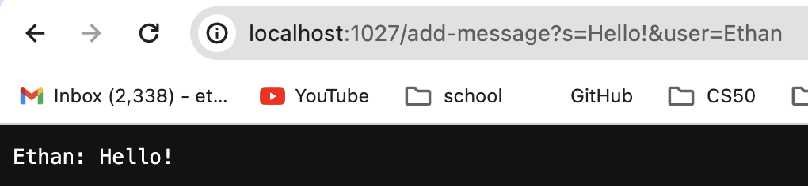
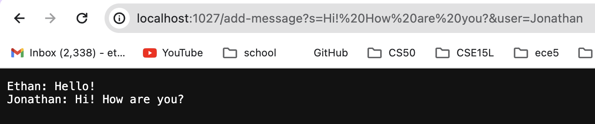
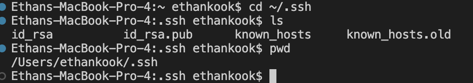
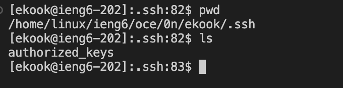
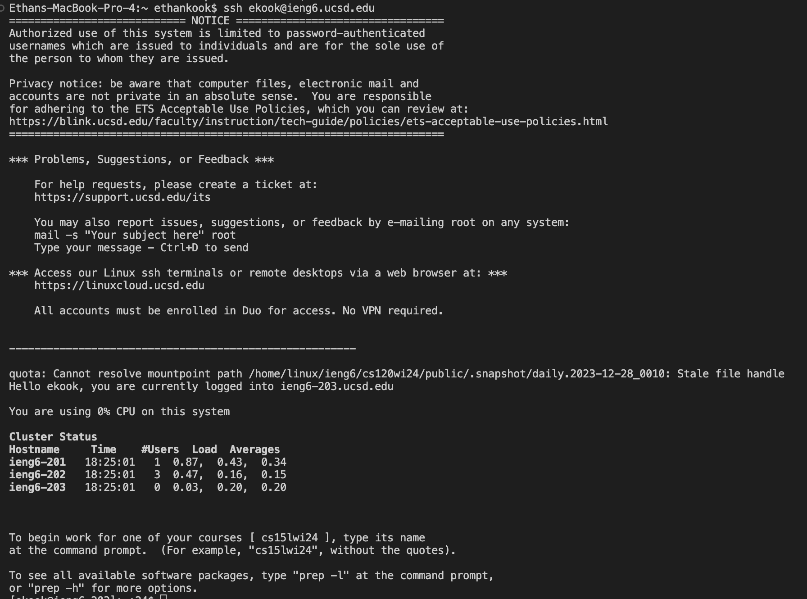

# Lab Report 2 - Servers and SSH Keys (Week 3)
**PART 1**

```
import java.io.IOException;
import java.net.URI;

class Handler implements URLHandler {

    int num = 0;
    String str = "";

    public String handleRequest(URI url) {
        if (url.getPath().equals("/")) {
            return str;
        }
        else {
            if (url.getPath().contains("/add-message")) {
                String[] query = url.getQuery().split("&");   //[0] = s=Hello, [1] = user=jpolitz
                String[] message = query[0].split("=");     //[0] = s, [1] = Hello
                String[] user = query[1].split("=");     //[0] = user, [1] = jpolitz

                if (message[0].equals("s") && user[0].equals("user")) {
                    str += String.format("%s: %s \n", user[1], message[1]);
                    return str;
                }
            }
            return "404 Not Found!";
        }
    }
}


class ChatServer {
    public static void main(String[] args) throws IOException {
        if(args.length == 0){
            System.out.println("Missing port number! Try any number between 1024 to 49151");
            return;
        }

        int port = Integer.parseInt(args[0]);

        Server.start(port, new Handler());
    }
}
```



*1. Which methods in your code are called?*

For both screenshots above, the method `handleRequest` is called.

*2. What are the relevant arguments to those methods, and the values of any relevant fields of the class?*

For the both screenshots shown above, the relevant argument for the method `handleRequest` is `URI url`, which is the path given in the url. The relevant fields are `String str` (the string that lists all of the messages and the user that said it), `String s` (the string given in the path of the url), and the three string arrays `String[] query`, `String[] message`, and `String[] user`. If the URL path contains `/add-message`, then the query following it is split into two different strings and appended to the array `query[]` in the 0 and 1 indexes. The string in `query[0]` is the message given in the query, while the string in `query[1]` is the name of the user who gave the message. In the first screenshot, `query[0]` is `"s=Hello"` and `query[1]` is `"user=Ethan"`. In the second screenshot, `query[0]` is `"s=Hi! How are you?"` and `query[1]` is `"user=Jonathan"`. The strings in `query[0]` and `query[1]` are then split once again into the the `message` and `user` arrays, respectively. In the both screenshots, the value of `message[0]` is `"s"` and the value of `user[0]` is `"user"`. In the first screenshot, `message[1]` is `"Hello!"` and the value of `user[1]` is `"Ethan"` In the second screenshot, `message[1]` is `"Hi! How are you?"` and `user[1]` is `"Jonathan"`.

*3. How do the values of any relevant fields of the class change from this specific request? If no values got changed, explain why.*

The values of all of the fields except `message[0]` and `user[0]` change for each request. This is because `message[0]` always contains the string `"s"`, while `user[0]` always contains the string `"user"`. `String str` always changes because with each valid request, it is updated and a new string is concatenated to it. `String s` also changes with each unique request because it is the query given by the url. Thus, the array `String query[]` must also change with each unique request because it is `String s` split into two different strings. `Message[1] and `user[1] also change with each request because it is the message given in the url and the user who said it. Unless the message is a repeat or the same user sends a message, these values will change.

**PART 2**



The screenshot above shows the paths for both the public and private keys. The absolute path for the public key is `/Users/ethankook/.ssh/id_rsa.pub`. The absolute path for the private key is `/Users/ethankook/.ssh/id_rsa`. 

The public key on my ieng6 account, however, is `/home/linux/ieng6/oce/0n/ekook/.ssh/authorized_keys`, as we copied the public SSH key onto our remote accounts in the `.ssh` directory, in a file called `authroized_keys`. The screenshot above shows my working directory, which is `~/.ssh` and the `authorized_keys` file with the public key inside.



The screenshot above shows a terminal interaction where I log into my `ieng6` account without being asked for a password.

**PART 3**

From the labs in week 2 and 3, I learned how to run a server remotely using `javac` to compile the source file, and `java` and a port number to run the server. I also learned about paths, URLs, and queries, and how to use them for your server. I learned how to use `git clone` to clone a repository and how to generate a public and private key using the `ssh-keygen` command. 
